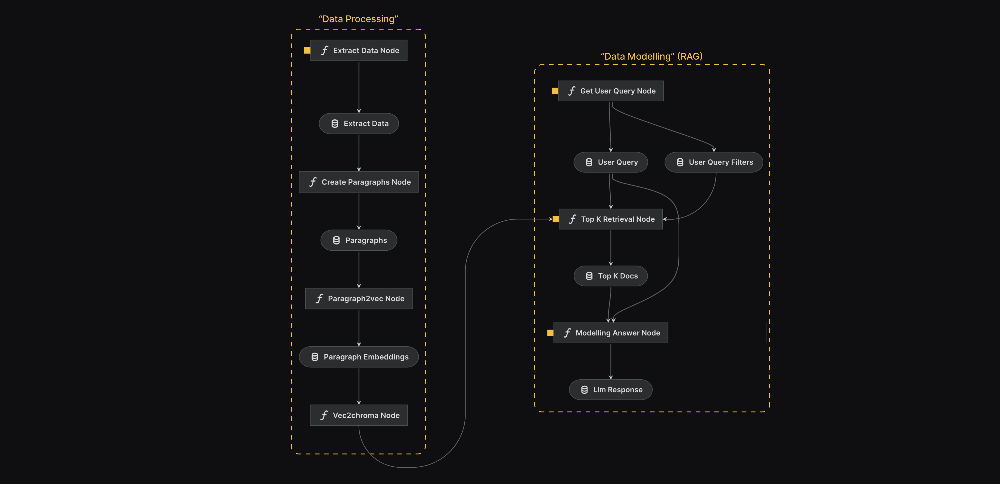
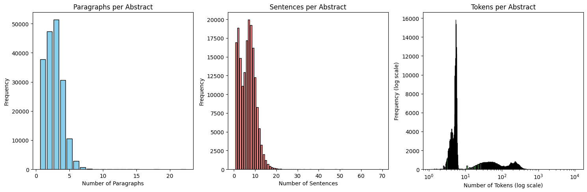
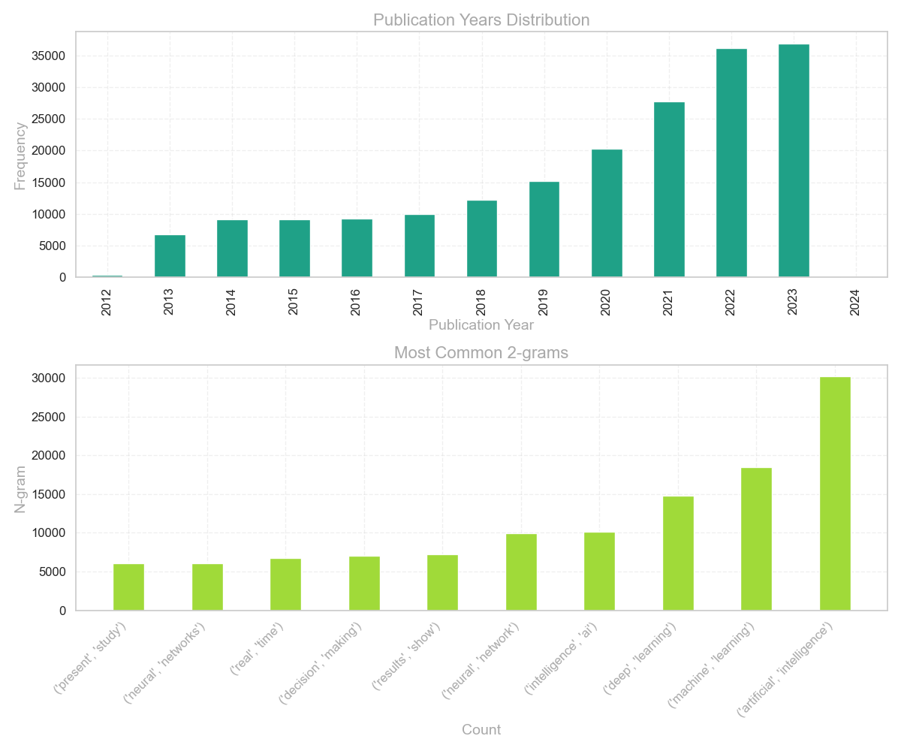
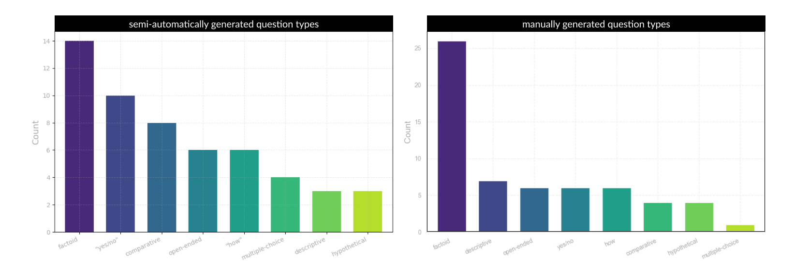

# Retrieval Augmented Generation based on PubMed Data

## Key Information

### Team Members
- [Kenneth Styppa](mailto:kenneth.styppa@web.de) (3735069, Scientific Computing)
- [Daniel Bogacz](mailto:daniel.bogacz@stud.uni-heidelberg.de) (3669985, Data and Computer Science)
- [Arjan Siddhpura](mailto:arjan.siddhpura@stud.uni-heidelberg.com) (3707267, Bachelor Informatik)

### Member Contribution

#### Kenneth Styppa
- Technical project orchestration via Kedro 
- Data Retrieval via Entrez API
- User input retrieval & preprocessing
- Document Retrieval (Dense, BM25, Hybrid, MMR, Filter)
- Filter Intention Extraction on user input for improving document retrieval.
- Text Generation Pipeline 
- Creating the semi-automatic evaluation set
- Organizational project orchestration

#### Daniel Bogacz
- Model Research and Selection (PubMedBert and LLama.cpp)
- Abstract Splitting into Paragraphs
- Creation of Embeddings for Abstracts and Paragraphs
- ChromaDB embedding insertion and interface for access in langchain
- Rule-based Filter Implementation using Intentions
- Validation and Evaluation Scripts

#### Full Name 3
- Contribution Description 3
- Challenges Faced 3

### Advisor
- [Satya Almasian](mailto:satya.almasian@gmail.com)

### Anti-plagiarism Confirmation
We affirm that we did the project on our own.

## Introduction
The increasing growth of published medical research poses a severe challenge for many healthcare practitioners and clinicians to meet demanding day-to-day tasks while staying informed about the fast-moving scientific progress in their domain [^9][^10]. Open databases such as PubMed partly face this challenge, by collecting, storing and maintaining this growing amount of biomedical knowledge. While healthcare professionals indeed refer to PubMed to obtain up-to-date answers to the questions they encounter in their day-to-day practice, with over 1 million new publications per year, extracting the relevant information to a question at hand can often be too time-consuming [^8]. Many questions that cannot be answered within a range of 3 minutes get neglected, possibly to the disadvantage of the affected patient [^11]. 
Question Answering Systems that use updated online information such as Pubmed as a database to provide summarized information to detailed questions could help to fill this crucial gap between a desired answer  and the amount of time necessary to obtain it. While first systems demonstrated this possibility[^12], they encountered severe challenges such as "(1) answer generation from potentially conflicting evidence, (2) utilization of semantic knowledge throughout the QA process, and (3) incorporation of logic and reasoning mechanisms for answer inference"[^12]. Recent advances in Large Language Models give reason to assume that these previous hurdles can now be overcome [^14].  
Although being pretrained on a vast corpus of data, Large Language Models (LLMs) applied directly for Q&A applications fail when being confronted with user requests that move beyond the scope of the model's pretraining data [^15]. This is an especially severe problem, if solutions to knowledge-intense tasks are desired, requiring the most recent information or highly specific expert knowledge [^16]. Retrieval-augmented (RAG) systems address this limitation by combining the strengths of both retrieval-based and generative models. In these systems, a retrieval component is used to identify and retrieve relevant information from an external knowledge source, such as a database or a collection of documents, which can be updated regularly to ensure access to the most recent information [^17]. The retrieved information is then fed into a generative model to create a coherent and accurate response to the user's request.
In this project, we test the possibility of creating a lean RAG system containing state-of-the-art components, which solves knowledge-intensive question-answering tasks and meets the high standards of the medical domain. To evaluate the performance of this system we created an evaluation set consisting of 53 semiautomatically and 60 manually crafted question-answer pairs. For evaluation we employed a two-staged grid search process, assessing the full pipeline end-to-end for over 64 combinations. The outcomes of the resulting best-evaluated system emphasized the potential of such a lightweight.
The remainder of this report is structured as follows. We first begin to give a brief overview of previously published work related to our project and highlight our main contributions in that regard. Second, we explain our employed methodologies in high detail, beginning with a general overview and then moving on to explaining the logic behind each noticeable component of the developed pipelines step-by-step. This technical section is succeeded by a description of the employed datasets for information retrieval and evaluation. The subsequent fourth section of this report discusses our approach to evaluating and identifying the best possible system with the developed components and analyses its performance on the previously described evaluation dataset. In the last section, we discuss the limitations of our proposed system, which were either identified during evaluation or development, informing opportunities for future work both in research and open-source software contribution.

## Related Work
Proclaimed to be the „next generation of search engines“ in 2003 applying question-answering systems to the medical domain is not a fundamentally new idea [^18]. Early systems, however, were restricted to question types such as definitional questions (i.e., “What is X?”) or generic question taxonomies[^19]. Employing a complex assembly of different linguistic methodologies such as question classification, pattern matching and using dependency relations to infer logic-forms of sentences, these first attempts although yielding impressive results at the time, lacked the necessary flexibility and performance to find wider adoption [^19]. The rise of large general-purpose language models, which store explicit knowledge in their parameters, functioning like a database and a text generator in one system made many of these complex interacting components obsolete, leading to a revolution in Natural Language Processing [^14]. Consequently, examining the performance of LLMs in question-answering applications is a field of increasing exploration, including possible medical applications [^20]. However, resource limitations in updating LLMs with recent information, persisting hallucination problems and the inability of LLMs to provide references for their factual answers endanger the trust necessary to ensure reliable applicability in the demanding environment of healthcare professionals[^20]. Retrieval-augmented question-answering systems have the aptitude to overcome these inadequacies leading to more robust, up-to-date and transparent results in especially knowledge-intensive tasks, utilizing the models' zero-shot capabilities to harness auxiliary data for completing complex tasks such as question answering [^22]. By combining information retrieval from an updateable knowledgebase, with a zero-shot capable LLM that takes the initial query together with the retrieved documents as a context for generating an answer, retrieval-augmented systems can control for the information used to generate an answer via prompting techniques, as well as reference its answers. Given these capabilities, retrieval-enabled systems exhibit considerable potential for applications in the medical field, driving forth increasing investigations in NLP-research [^21] [^22]. 

Zakka et al [^21] proposed Almanac, a retrieval-augmented system employing GPT-4 as an LLM and a vector store as a knowledgebase, containing the embeddings generated with text-embedding-ada-002 from OpenAI of scientific articles retrieved from PubMed,52 UpToDate and BMJ Best Practices. Similarly, Lozano et al [^22] proposed Clinfio.ai, a retrieval-augmented system based on Pubmed and a combination of GPT-3.5 and GPT-4 models to extract and summarize relevant information as well as generate an answer. Both applications outcompete standard LLMs along their metrics of choice, demonstrating the capacity of retrieval-augmented question-answering in medicine. While achieving these impressive results, both systems follow an approach of nesting several LLMs for query simplification and dynamic retrieval from Pubmed, making the resulting application a powerful combination of partly closed-source software that runs at least in part not locally. 

In light of this background our main contribution is the following: 
Contrary to the systems discussed above, we demonstrate the ability to build a relatively lightweight approach with local runtime capacity based exclusively on open-source software. In other words, we demonstrate the possibility of creating a well-performing system for answering knowledge-intense medical questions without the need to share possibly sensible patient data with a third party through API calls. In doing so, we highlight several limitations of currently existing state-of-the-art technologies that may inform future work to further close the nevertheless persisting gap between performance and data privacy. 


## Methods/Approach
The following section gives a detailed overview of the methods applied. Our explanations go beyond the scope of a typical research paper since this documentation serves the function of a technical report. For the reader without deeper technical interest, the general section on our employed architecture should suffice and the rest may be skipped. 

```
Provide conceptual details of the system, including data processing pipelines, algorithms, and key methods. Be specific about methods, and include equations and figures where necessary. Clearly distinguish original contributions from existing methods.
```
### RAG architecture
The development of the RAG system was organized into two distinct pipelines, facilitating the process of creating an RAG System end-to-end in a structured manner.  The first pipeline contained all the nodes that laid the groundwork for the system. These ranged from data extraction to text chunking and preprocessing, as well as document embedding into the chroma vector store. The second pipeline uses the resulting vector store as a database for eventually creating the RAG system as a series of three nodes which encompass obtaining and cleaning user input, retrieving relevant documents, and using both of the former as input and context for text generation via a quantised llama2 model. 

### Technical orchestration

For our technical orchestration, we employed Kedro, an open-source data pipeline framework to create reproducible, maintainable, and modular data science code [^1]. Due to the complexity and the strong interdependence of these components, using Kedro was crucial to enforcing code quality and system stability. Furthermore, the ability to extract system settings such as prompt templates, retrieval strategies and model hyperparameters into the `parameters.yml` file streamlined our evaluation procedure by providing the possibility to perform a grid search over a predefined set of parameters for the full modelling pipeline which we structured into a separate evaluation pipeline. While this enhanced stability of Kedro was a crucial benefit during development and evaluation, the actual deployment of the pipeline as a user-friendly application was structured into a one-node "chat" pipeline since the modular architecture of Kedro forces to re-initialize our model for each new query/pipeline run. This severely disrupts its usage flow and is a conceptual flaw of the basic Kedro setup that is rooted in its construction for general Machine Learning scenarios instead of highly repetitive LLM applications. Using one single chat node that encompasses all steps from the modelling pipeline solves this issue. Still, we want to highlight that this is only a prototyping solution. For a system in production, such redundancies must be avoided. Developing a solution for this problem on top of the current Kedro architecture was, however, beyond the scope of this project. It is our hope nonetheless, that Kedro will support LLM pipeline flows in the future, making this step less burdensome.
In the following paragraphs, we will highlight the noticeable aspects of each of these pipelines and nodes, providing an overview of the challenges faced and the solutions built. The technically interested reader can find all relevant parameters and system settings mentioned throughout the following detailed explanation in the parameters.yml file of this repository.

### Data Processing Pipeline
#### Data Extraction
Extracting the data for this study was performed via the Entrez Programming Utilities API. Provided by the National Center for Biotechnology Information (NCBI) Entrez offers free, although limited access to retrieve data from various NCBI databases, including PubMed [^2]. The procedure of obtaining the data mainly included two steps: 
1. Using Entrez's research function to retrieve article IDs from Pubmed that match the project requirements (more details: data section).
2. Using Entrez's efetch function to retrieve detailed information for each of the retrieved IDs, and writing the retrieved results returned from the handle into a dataframe.

To avoid API limitations and stability issues for large-scoped retrieval, we conducted these two steps in a batch-wise manner. First, we used a sliding window of 30 days for which we retrieved the article IDs iterating over the whole timeframe on a month-by-month basis. Second, when having obtained the full ID list, we fetched the abstracts including their metadata for chunks of 500. 

#### Text Preprocessing and Chunking
Having extracted the relevant abstracts, the next step is to split them into right-sized fragments to ensure the relevance of the retrieved results downstream in the retriever step of the system. Finding this optimal chunk size is a trade-off between context and specificity. It is generally acknowledged that neither too small nor too large chunk sizes are desirable since they "[...]may lead to sub-optimal outcomes" [^3]. With an average of 6.3 sentences and 183 tokens per abstract, the  size of our documents was moderate. In addition, the maximum input length of 512 tokens in our embedding model, was only violated in 0.3% of the cases. Consequently, it was not evident whether embedding the full abstracts already suffers from the problems of large chunk sizes.  To test this end-to-end, we employed two embedding strategies. One embeds the full abstracts while the other employs a semantic chunking approach. To eventually determine the optimal chunk size for our production systems we compared the full systems performance with either of these strategies. 

#### Abstract Chunking and Document Embedding
To enable the model to make use of specific granular information which gets retrieved from the vector database, a weighted embedding splitting point search approach was used. This method was heavily inspired by the medium article "How to chunk text into paragraphs using Python" by N Polovinkin [^27]. First, a cosine similarity matrix of all sentences in the abstract was created, to identify which sentences are more or less similar to each other. Then, starting from the entries right from the diagonal, a weighted sum to the next sentences is calculated for each sentence. The closer the next sentence is to the starting point sentence, the higher the importance weighted by an inverted sigmoid function. This way, the similarity from each sentence to the next sentence is computed. This weighted sum for each sentence can be interpreted as a function. From this function, local minimums or splitting points are found, which can be interpreted as suitable points of paragraphs, as these local minima are points, where the next sentences are dissimilar to the corresponding sentence in the function. With the splitting points the abstracts were split into chunks, where each chunk is now represented as a distinct document itself. When no suitable local minimum could be identified, the abstract was not modified. Each abstract was split into 2.36 paragraphs on average, effectively doubling the amount of documents for the vector database. This results in more memory required to initialize the vector database, where memory for local setups on standard laptops and computers is already a scarce resource, and also longer search times for similar documents. These more demanding computing requirements are a trade-off for potentially more accurate retrieval of information and therefore better-generated answers by the LLM. Another caveat in this approach is the very small embedding distances between the sentences in the abstracts. Even though determining the splitting points proved to be successful, the embedding similarities of the sentences were already very high for all sentences, residing between 0.8 to 0.98. So even though all the sentences were very similar already between each other, the splitting points have been identified based on rather minor embedding distances between the sentences.

For generating embeddings a suitable Embedding Model had to be chosen. Because the embeddings of tokens might vary depending on the context, in this case, a biomedical domain, a general BERT-based model like DistilBERT [^28] which was considered earlier in the project would not be appropriate. Especially as specific medical terms which are very common in biomedical papers might not be included in the vocabulary. Instead, the sentence transformer [S-PubMedBert-MS-MARCO](https://huggingface.co/pritamdeka/S-PubMedBert-MS-MARCO) was used which is based on [BiomedNLP-BiomedBERT-base-uncased-abstract-fulltext](https://huggingface.co/microsoft/BiomedNLP-BiomedBERT-base-uncased-abstract-fulltext), a model by Microsoft specifically trained on abstracts found in PubMed. The sentence transformer has been fine-tuned over the MS-MARCO dataset and is able to generate embeddings for whole sentences instead of tokens.

The abstracts and the paragraph embeddings were created with a fundamentally different approach. The abstract were left as there are, including all metadata information like Title, Year and Authors, which were embedded together with the actual abstract text. An example of a document based on an abstract which is embedded with all possible metadata options can be seen in the following:

```
Title: Disorders of communication: dysarthria.
Authors: Pam Enderby
Affiliations: NA
Qualifier: NA
Major Qualifier: NA
Descriptor: Dysarthria, Humans, Speech
Major Descriptor: Dysarthria
Journal: Handbook of clinical neurology
Language: eng
Year: 2013
Month: NA
Abstract: Dysarthria is a motor speech disorder which can be classified according to the underlying neuropathology and is associated with disturbances of respiration, laryngeal function, airflow direction, and articulation resulting in difficulties of speech quality and intelligibility. There are ...
```

For paragraphs, however, the metadata information was removed and only the paragraph text was embedded. The idea here is to achieve as much granularity as possible, as the metadata can significantly shift and deteriorate the actual meaning of the text if the metadata takes a large area of the possible embedding space. To still facilitate the search for specific metadata aspects like Title and Authors, which are essentially removed from the paragraph embedding space, the removed metadata was added to the vector database separately to each embedding where filters can be applied to narrow down the search space, which is constructed from rule-based filters, which in turn where created from extracting user query intentions. However, even though metadata has been removed from the paragraphs for the embedding, the metadata is still included in the document text when retrieving the most similar document embeddings, so that the LLM can make use of more context if necessary. Whether metadata is included in the document text inserted in the prompt for the LLM, both for abstract-based embeddings or paragraph-based embedding, can be controlled by the parameter `abstract_only` in the `parameters.yml` file.

For document retrieval the vector database [ChromaDB](https://docs.trychroma.com/) was used. Early in the project the database [elasticsearch](https://www.elastic.co/elasticsearch) which also implements vector search was considered, but quickly dropped, as [ChromaDB](https://docs.trychroma.com/) is directly integrated in [LangChain](https://python.langchain.com/docs/get_started/introduction), the main framework used for implementing the chat application. This direct integration made the use of Chroma very accessible and easy out of the box. Each inserted embedding in Chroma was together added with a document text, which gets retrieved when searching for the most appropriate embedding, and optionally metadata, which can be used to narrow down the search space with filters like previously mentioned.

### Data Modelling Pipeline for Text Generation
### Obtaining and postprocessing user input
The user's question was obtained via a simple command line input prompt. This input was forwarded to a spellchecking procedure [^25]. Spellchecking was necessary to ensure the applicability of BM25 which is based on exact term matches. Since the medical vocabulary is likely to contain words that could be falsely corrected (e.g. "ccRCC" gets corrected to "circa"), the correction was performed only token-wise, giving the user the ability to include specific words in asterisks which will then be ignored by the spellchecker. After the query has been corrected it is passed into a module that performs named entity recognition using "en_core_web_sm" from Spacy in conjunction with handcrafted linguistic rules to extract author names as well as time ranges indicated in the user query as filter options during the subsequent retrieval stage.

### Document retrieval 
For retrieving the relevant documents to a user's input query we first filtered out all documents that matched the filter statements extracted in the previous step, e.g. only publications with a publication year between 2020 and 2023. This narrowed down the database for the actual retrieval operation that followed subsequently. Our retriever node employed two main retrieving strategies that were each tested and compared in the evaluation phase of the project and can be easily switched on and off in the `parameters.yml` file. Independent of which strategy is chosen, the number of retrieved documents was controlled by the top_k parameter in the `parameters.yml` file.

The following paragraphs will briefly introduce each of the employed strategies. 
#### 1) Dense Retrieval Strategies
Dense retrieval with either pure cosine similarity or max marginal relevance, which is also based on cosine similarity but tries to enforce dissimilarity and therefore greater diversity upon the retrieved documents while retaining high similarity with the original query.

###### a) Cosine Similarity
Cosine similarity is a fundamental metric used in natural language processing to quantify the similarity between two vectors. In the context of our retriever, cosine similarity is employed to measure the angle between the query vector \(Q\) and the document vector \(D\), producing a numerical representation of their similarity. The formula for cosine similarity is given by:
$$\text{Cosine Similarity}(Q, D) = \frac{Q \cdot D}{\|Q\| \cdot \|D\|}$$
Where $Q \cdot D$ is the dot product of the query and document vectors, and $\|Q\|$ and $\|D\|$ are the Euclidean norms of the respective vectors.

###### b) Max Marginal Relevance (MMR)
Max Marginal Relevance (MMR) fosters diversity among the retrieved documents while maintaining high relevance to the query. Given a query Q, a list of documents R and a subset S of R that contains already selected documents, MMR as an incremental operation is defined as follows:

$$\text{MMR} = Arg max_{D_i \in R\setminus S} [\lambda (\text{Cosine Similarity}(D_i, Q) - (1 - \lambda) \cdot \max_{D_j \in S}(\text{Cosine Similarity}(D_i, D_j))]$$ 
I.e.,  $\lambda$ controls the trade-off between relevance and diversity. If $lambda = 1$ a cosine similarity output is obtained. For $lambda = 0$ maximum diversity is enforced [^4].

#### 2) Ensemble Retrieval Strategy
Our ensemble retriever combines dense retrieval (based on either cosine similarity or max marginal relevance) with BM25, a term-frequency-based retrieval operation specifically suited for providing exact term-based matches. It has been shown that Okapi BM25 can perform worse than some alternatives such as BM25L, when confronted with longer documents [^6]. Nevertheless, we chose this algorithm since an average of 182 tokens and 6.3 sentences per abstract which again were split into 2.7 paragraphs per abstract, neither the abstracts themselves and especially not the chunked paragraphs fall into the category of "very long documents" as Yuanhua et. al characterized the problematic cases. The underlying idea of running both retrievers in parallel is to ensure that both exact term-based relevance, as well as context-based relevance, are captured and later combined via the reciprocal fusion rank. The BM25 score for a document D given a query Q consisting of $q_i$ terms with i = 1, ..., n is:   

$$\text{BM25}(Q, D) = \sum^n_{i \in Q} IDF(q_i) \cdot \frac{{tf(q_i,D)*(k_1+1)}}{{tf(q_i, D) + k_{1} \cdot (1 - b + b \cdot \frac{{\text{docLength}}}{{\text{avgDocLength}}})}}$$

Where:
- $tf(q_i,d)$ is the term frequency of term $\(i\)$ in the document d.
- $IDF(q_i) = ln(\frac{N-n(q_i)+0,5}{n(q_i) + 0.5}+1)$ is the inverse document frequency weight of the term $q_i$
- $N$ is the total number of documents in the collection and $n(q_i)$ the number of documents containing $q_i$.
- $k_{1}$ is a tuning parameter (k = 0: no use of term frequency, large k: raw term frequency.
- $b$ is a parameter controlling the impact of document length normalization.
- $\text{docLength}$ is the length of the document.
- $\text{avgDocLength}$ is the average document length in the corpus.

The Reciprocal Fusion Rank formula combines rankings from the dense retrieval strategy and BM25. Given a set D of documents to be ranked and a set of Rankings R (with cardinality 2 in our case), the RRF score is determined by

$$RRF(d \in D) = \sum_{r \in R}\frac{1}{k+r(d)}$$

Out of this eventually ranked set of retrieved documents the `top_k` are extracted.

Since  medical terminology can pose various challenges, no retrieval strategy exhibits a clear conceptual superiority apriori, although intuition suggested that a combination of context and specificity is possibly best suited to the wide-ranging and oftentimes critical queries in the medical domain [^7]. Through deploying, testing and comparing these different retrieving strategies, we thus aimed to identify the retriever which meets the requirements the best using a diverse manually annotated validation set.

### Obtaining LLM output
#### LLM models used
[TODO] Write a short paragraph about Pubmed Bert and llama2.cpp @Kenny

#### Prompting strategies
Once the `top_k` documents are extracted, they are formatted together with the initial (possibly corrected) query into a prompt that is inputted into our model. Due to the usage of a quantized model and the accompanying limitations which became evident in the first runs of the pipeline, a relatively short and precise prompt was selected. While this selected prompt was fixed during evaluation to restrict the amount of grid search combinations, we tested the impact of including  abstract information only versus also including metadata information into the input prompt. This was of course only necessary due to the limitations of our model since it was not evident whether it could handle the increasing complexity of the input prompt with the metadata included. Further details will be discussed in the subsequent section on the experimental set-up of the study. 


## Experimental setup and results

### Knowledgebase datasets
The data for this study was sourced from the PubMed database, a comprehensive repository of publications in biomedical research. 
The inclusion criteria for articles encompassed those that explicitly addressed or discussed topics related to intelligence between 2013/01/01 and 2023/11/01.

The retrieved data set consisted of 193.827 retrieved documents of which 6.36 contained no abstracts. In addition to the abstracts, we extracted various possibly relevant metadata which included the title of the document, the name of its authors, their affiliations, high and low-level topic descriptors, the journal in which it was published as well as the year and month of its publication. On average the data obtained consisted of 6.3 sentences and 183 tokens per abstract. Overall, large abstracts were the exception, as can be seen in Figure 2. Only 0.3% of the abstracts exhibited a token length larger than 512, the maximum input length in the applied embedding model. To test if this has an impact on our system's performance, we created a second data set out of this first one, by chunking each abstract into 2.7 paragraphs which we then treated as separate documents. This increased granularity makes the average document in the second dataset contain approximately 2.33 sentences, thus resulting in a more granular context scope. As part of our evaluation procedure, we compare the system's performance once using the first dataset (full abstracts) and once using the second dataset (paragraphs).

Considering the timeframe of our extracted abstracts, it is not surprising that nearly all articles have an attributed publishing year between 2013 and 2023. The very few articles that fall into the categories of 2024 and 2012 can most likely be traced back to inaccuracies in the Entrez API or Pubmed itself. Within the time range of 2013/01/01 and 2023/11/01, the retrieved data exhibits a heavily left-skewed publication year distribution. As can be seen in Figure 3, a possible explanation for this increased publication growth is the general rise of research in "artificial intelligence" (count:30176) which is the most common bigram among all abstracts, followed by "machine learning", "deep learning", "intelligence, ai" and "neural, network(s)". 
Nevertheless, the dataset goes beyond the scope of artificial intelligence research. Aside from typical academic bigrams such as "present study", biomedical-related bigrams such as "decision making" (count: 7019), "health, care" (count: 5563), "physical, activity" (count: 4698) or even specific vocabulary such as "autism, spectrum" (count: 2132) or "computed, tomography" demonstrate the variety of the retrieved abstracts. Consequently, the dataset is suitable to represent a typical knowledge base for a RAG system in the medical domain.

#### Evaluation data set
Existing evaluation datasets such as PubmedQA [^23] were inapplicable as the questions contained went beyond the scope of the inclusion criteria set forth by the organisational team of the lecture. To obtain an alternative dataset for evaluation, three different approaches were possible: a manual, a semi-automated and a fully automated approach. All three were based on different random subsets of the abstracts retrieved in the data extraction phase of the pipeline. Using this subset both the semi-automatic as well as the manual approach contained a stage where for each abstract one question was derived, which a human should be able to answer given the corresponding abstract as a context. The automated approach instead, fed the abstract together with a task description into Gemini, instructing it to automatically create a question of a randomly varying question type based on the abstract. In the second stage of the dataset generation phase, the manual approach included the process of manually answering each previously created answer, thus serving as human-generated ground truth. Both the fully-automated as well as the semi-automated approach encompassed prompting GPT 3.5 to generate an answer to the given question based on the corresponding abstract as a context.
Although substantially faster, the fully automated approach yielded poor question-answer pairs as determined in our qualitative screening procedure. Out of 25 generated question-answer pairs only 6 passed the quality checks of encompassing: 
a) answerableness by a human with the correct context
b) meaningfulness of the question
c) correctness of the answer

Given these reliability issues, the fully automated approach was completely abandoned. Both the manual as well as the semi-automated approach led to adequate pairs leading to one fully human and one partly LLM-generated data set on which the resulting system can be compared. 


After quality checks, the resulting semi-automated dataset consisted of 53 question-answer pairs of which the majority were yes/no question-answer pairs (9), followed by comparative (8) and what (8) as well as how (6) and open-ended (6) questions. 
The manually generated question dataset contains 60  question-answer pairs, of which the majority were factoid (asking 'which' and 'what') (26) and descriptive (7) questions, followed by open-ended (6), yes/no (6), how (6), comparative (4), hypothetical (4) and multiple-choice (1) questions. Consequently, the total dataset consisted of 113 question-answer pairs for evaluation, assessing different difficulties and question types, with a focus on factoid questions. Especially in the manually generated dataset, emphasis was put on diversity within each of the mentioned categories. Consequently within each category different capacities were necessary to perform well, which included but was not limited to: inferring causal relationships, extrapolating correct scenarios or locating and filling a gap.

### Evaluation Method
To reproducibly determine the best possible system with the given components, we ran a grid-search validation script that tests various combinations end-to-end, computing their performance on a validation set consisting of 47 questions, equaling about ~40% of the whole available data, sampled from all possible categories of the question. The remaining 66 questions were used as a test set for evaluation of the system performance on different question categories as well as evaluation of the retrievers. The performance for validation and question type evaluation was measured by BLEU, ROUGE, BERTScore and BleuRT scores. The retriever evaluation performance was measured by recall, where for one example the recall is either 1 or 0, depending on whether one of the retrieved sources is the gold source, which is always one abstract.

We include BLEU and ROUGE in our validation and evaluation metrics due to historical reasons, as they mainly measure lexical overlap, which can be useful for translation tasks but are very misleading when the phrasing of answers is different but essentially correct. The most important scores are BERTScore and BleuRT, which are neural-based methods and better suited to measure the similarity between generated answer and gold answers [^29]. To rank the combinations we define the metric 'Weighted Score' as a combination of the previously mentioned scores which can be computed in the following way:

$$\text{Weighted Score} = \text{BLEU} \cdot 0.1 + \text{ROUGE} \cdot 0.1 + \text{BERTScore} \cdot 0.4 + \text{BleuRT} \cdot 0.4$$

The metric 'Weighted Score' is a combination of multiple other metrics and better represents the significance of the different metrics, making it a very robust and suitable measure to compare the results.

### Experimental Details
For validation the following parameters and different options were used for the validation gridsearch, resulting in a total of 64 different combinations which need to be evaluated:

| Parameter | Options used for Validation |
| --- | --- |
| temperature | [0, 0.5] |
| abstract_only | [True, False] |
| metadata_strategy | [parser, none] |
| granularity | [abstracts, paragraphs] |
| top_k | for abstracts: [2, 3] -- for paragraphs: [4, 6] |
| retrieval_strategy | [Similarity, Max Marginal Relevance (MMR)]

TODO: Explain all options [Kenny]

For all experiments, the following prompt was used:

```
You are a biomedical AI assistant to answer medical questions
mostly about PubMed articles provided as context for you.
As an AI assistant, answer the question accurately,
precisely and concisely. 
Not every article in the provided context is necessarily relevant to the question.
Carefully examine the provided information in the articles and choose the
most likely correct information to answer the question.
If the question is not from the biomedical domain, tell the user that
the question is out of domain and cannot be answered by you.
Only include information in your answer, which is necessary to answer the question.
Be as short as possible with your answer.

Use the following articles to determine the answer: {context}
The question: {question}
Your answer:
```

The keyword 'context' contains the provided texts of the retrieved documents of the vector search and the keyword 'question' is the user query.

TODO: Explain evaluation of question types with and without ensemble retriever and retriever evaluation @Daniel

### Results
#### End-to-End Validation Results
| temperature | abstract_only | metadata_strategy | granularity | top_k | retrieval_strategy | BLEU | ROUGE | BERTScore | BleuRT | Weighted Score |
| --- | --- | --- | --- | --- | --- | --- | --- | --- | --- | --- |
| 0.5 | True | parser | abstracts | 2 | MMR | 6.41% | 18.88% | 76.81% | 44.04% | 50.87% |
| 0 | True | parser | abstracts | 2 | MMR | 6.60% | 19.71% | 76.91% | 43.68% | 50.87% |
| 0 | True | none | abstracts | 2 | MMR | 6.57% | 19.78% | 76.92% | 43.59% | 50.84% |
| 0.5 | True | none | abstracts | 2 | MMR | 7.12% | 17.54% | 77.11% | 42.72% | 50.40% |
| 0.5 | True | none | abstracts | 3 | MMR | 5.59% | 18.44% | 76.19% | 42.96% | 50.06% |

#### End-to-End Evaluation Results
TODO: @Daniel

#### Retriever Evaluation Results
TODO: @Daniel

### Analysis
TODO: Include qualitative analysis. Discuss system performance in different contexts and compare with baselines. @Daniel

## Conclusion
In this study, we successfully created a locally running question-answering system, fully based on free-of-charge open-sourced technology. Although challenges persist, this study demonstrates the potential of such systems to manage knowledge-intensive tasks such as medical question answering based on the effective distillation and dissemination of a highly specialised external knowledge base in modern healthcare. Thus, by bridging the gap between a desired question and a reliable, referenced and therefore controllable answer, patient care can be improved and healthcare practitioners relieved without the dangers of sharing sensible data, emphasising the capacity of AI advancements to benefit humanity. 

### Limitations and Future Work 
The most severe and yet unavoidable limitation of our proposed system is that of the used model. Since during development no computational resources were available to us save for our laptops, we needed to use a quantized llama2.cpp model to ensure that developing and testing the system was possible in a reasonable timescope. While the model performed adequately in text generation, its limitations made certain operations that demanded a more powerful model impossible. This was especially noticeable when implementing the model as part of a self-querying logic provided by langchain to extract metadata filters out of the provided user input query (e.g. author names, paper titles etc.). The most severe of the encountered problems was the model inventing filters where none were indicated. Since this hallucinating behaviour would have caused severe issues downstream due to false filter operations previous to document retrieval, we decided to implement a less powerful, although more stable solution. This solution employs Spacy's "en_core_web_sm" module and manually crafted linguistic rules to detect publishing dates and author names. While possibly missing some filter intentions as a result of being trained on typical English texts such that e.g. Chinese author names are missed, this solution does not invent filters where none are indicated and is thus the significantly better choice. And yet, equipped with a more powerful model aside from improved text generation performance, such and similar operations (such as including an LLM as a spellchecker [^26]) could have had a considerable impact on improving our system. 

Furthermore, during development, some of our initial ideas were not implementable since the underlying code functionality could not be guaranteed due to errors in the source code of Langchain (s. [issue](https://github.com/langchain-ai/langchain/issues/15959) ). This specifically accounts for our idea to implement and test a [multi-query retrieval strategy](https://python.langchain.com/docs/modules/data_connection/retrievers/MultiQueryRetriever), which uses an LLM to generate queries based on the user input, retrieves documents for each query and then outputs the intersection set of all retrieved documents as the final retrieved set. However, given the already-discussed model limitation, it is likely that even if the issue had been fixed, no improvements would have been gained by deploying the strategy since the generated questions likely would not have been superior to the original user query. Similarly, the implementation of RAGAS for evaluating our model using novel, holistic metrics specifically created for retrieval-augmented systems was not possible due to persisting issues in its source code. 
Additionally, serving as a minimum viable product of a medical Q&A system, components for an improved user experience are underdeveloped. This includes the absence of a graphical user interface.

Further limitations regarding our evaluation method could be caused by the lack of an already existing evaluation dataset for our specific setting (i.e. keyword = intelligence). The procedure of manually creating a validation dataset can be prone to subjective bias in creating the question-answer pairs. In addition, each validation instance only contained one abstract from which each question-answer pair was generated. This can possibly lead to over-penalizing our retriever strategy on general questions, where the probability that the actual abstract is not among the top_k selected abstracts is high, as many similar abstracts exist in the knowledge base. While this limitation was already evident when creating the validation set, identifying a whole set of abstracts as the ground-truth context was beyond the scope of this project. Another limitation of our implemented evaluation strategy is the small number of validation instances. Experiments to enlarge this number by generating question-answer pairs using Gemini to generate a question, and Chat GPT to generate an answer were not reliable to serve as a ground-truth evaluation set due to the high specificity and complexity of the medical abstracts. 

Furthermore, through the inclusion of another LLM to identify the relevant sentences of the retrieved documents, referencing the sources for a provided answer could have been made more precise than the current solution of outputting the top_k documents as a reference. Using such precision together with the right prompt to make the text generating LLM indicate which context was used for which part of the output, answer postprocessing and text highlighting together with cross-referencing, could have led to a powerful referencing feature posing a significant advantage for medical researchers and clinicians over existing solutions such as ChatGPT. However, implementing such a chained text generation pipeline would have severely enlarged the local runtime of our system, while experiments showed that the accompanying increased complexity of the input prompts for such a feature goes beyond the capacity of the employed quantized llama2 model. Likewise, temporality is only partly considered in the current system. While named-entity recognition in conjunction with manual linguistic rules was applied to detect filter intentions for information published within a certain time window out of the user query, document recency is not reflected in our document retrieval stage. Incorporating time as a fourth dimension to term-frequency, filter matching and semantic similarity could lead to answers that align closer to the needs of practicing clinicians. Gade et al proposed an approach to perform this inclusion of recency that might prove fruitful for future investigations [^24].

Aside from implementing the previously mentioned issues of young and impressibly growing open-source software, a possible avenue for further research is the usage of event processing methodologies, to extract and build a more sophisticated filter strategy, that further strengthens the RAG system in its critical retrieval stage. Further fields of possible extension of this study are vast, including but not limited to:
1. Benchmarking different retrieval strategies on well-established data sets
2. Assessing the ability of rag systems to answer questions that demand linguistic causal knowledge throughout the whole pipeline
3. Implementing novel retrieval strategies such as embedding llm-generated questions per abstract instead of the abstract itself to then retrieve the underlying abstract via the query-question-embedding match.

Last but not least, a more general field of interest is the extension of the proposed system to an actual application scenario in the clinical setting on sensible data for which the capacity to not disclose information to a third party is crucial. The experience gained from this project suggests basing the application at least on a local server paired with GPU capacity, to equip the system with a more powerful model, a graphical user interface and a possibly nested text-generation pipeline to implement the cross-referencing feature mentioned above. 

### Acknowledgements
We thank Prof. Gertz for this exceptionally engaging course and Satya for her time to give us helpful advice.
   

## References
[^1]: B. Deepa and K. Ramesh, "Production Level Data Pipeline Environment for Machine Learning Models," 2021 7th International Conference on Advanced Computing and Communication Systems (ICACCS), Coimbatore, India, 2021, pp. 404-407, doi: 10.1109/ICACCS51430.2021.9442035.

[^2]: Entrez Programming Utilities Help [Internet]. Bethesda (MD): National Center for Biotechnology Information (US); 2010-. Available from: https://www.ncbi.nlm.nih.gov/books/NBK25501/

[^3]: Gao, Yunfan, et al. "Retrieval-augmented generation for large language models: A survey." arXiv preprint arXiv:2312.10997 (2023).

[^4]: Carbonell, Jaime, and Jade Goldstein. "The use of MMR, diversity-based reranking for reordering documents and producing summaries." Proceedings of the 21st annual international ACM SIGIR conference on Research and development in information retrieval. 1998.

[^5]: Brown, Dorian. "Rank_bm25". Retrieved from: https://github.com/dorianbrown/rank_bm25. Date: 15.02.2024

[^6]: Lv, Yuanhua, and ChengXiang Zhai. "When documents are very long, bm25 fails!." Proceedings of the 34th international ACM SIGIR conference on Research and development in Information Retrieval. 2011.

[^7]: Agrawal, Shweta, and Sanjiv Kumar Jain. "Medical text and image processing: applications, issues and challenges." Machine Learning with Health Care Perspective: Machine Learning and Healthcare (2020): 237-262.

[^8]: Landhuis, Esther. "Scientific literature: Information overload." Nature 535.7612 (2016): 457-458.

[^9]: Bougioukas, Konstantinos I., et al. "How to keep up to date with medical information using web‐based resources: A systematised review and narrative synthesis." Health Information & Libraries Journal 37.4 (2020): 254-292.

[^10]: Andrews, James E., et al. "Information-seeking behaviors of practitioners in a primary care practice-based research network (PBRN)." Journal of the Medical Library Association 93.2 (2005): 206.

[^11]: Daei, Azra, et al. "Clinical information seeking behavior of physicians: A systematic review." International journal of medical informatics 139 (2020): 104144.

[^12]: Gobeill, Julien, et al. "Question answering for biology and medicine." 2009 9th International Conference on Information Technology and Applications in Biomedicine. IEEE, 2009.

[^13]: Athenikos, Sofia J., and Hyoil Han. "Biomedical question answering: A survey." Computer methods and programs in biomedicine 99.1 (2010): 1-24.

[^14]: Min, Bonan, et al. "Recent advances in natural language processing via large pre-trained language models: A survey." ACM Computing Surveys 56.2 (2023): 1-40.

[^15]: Zhuang, Yuchen, et al. "Toolqa: A dataset for llm question answering with external tools." Advances in Neural Information Processing Systems 36 (2024).

[^16]: Lewis, Patrick, et al. "Retrieval-augmented generation for knowledge-intensive nlp tasks." Advances in Neural Information Processing Systems 33 (2020): 9459-9474.

[^17]: Yin, Da, et al. "A survey of knowledge-intensive nlp with pre-trained language models." arXiv preprint arXiv:2202.08772 (2022).

[^18]:Jacquemart, Pierre, and Pierre Zweigenbaum. "Towards a medical question-answering system: a feasibility study." The New Navigators: From Professionals to Patients. IOS Press, 2003. 463-468.

[^19]: Lee, Minsuk, et al. "Beyond information retrieval—medical question answering." AMIA annual symposium proceedings. Vol. 2006. American Medical Informatics Association, 2006.

[^20]: Thirunavukarasu, Arun James, et al. "Large language models in medicine." Nature medicine 29.8 (2023): 1930-1940.

[^21]: Zakka, Cyril, et al. "Almanac—Retrieval-Augmented Language Models for Clinical Medicine." NEJM AI 1.2 (2024): AIoa2300068.

[^22]: Lozano, Alejandro, et al. "Clinfo. ai: An Open-Source Retrieval-Augmented Large Language Model System for Answering Medical Questions using Scientific Literature." PACIFIC SYMPOSIUM ON BIOCOMPUTING 2024. 2023.

[^23]: Jin, Qiao, et al. "Pubmedqa: A dataset for biomedical research question answering." arXiv preprint arXiv:1909.06146 (2019)

[^24]: Gade, Anoushka, and Jorjeta Jetcheva. "It's About Time: Incorporating Temporality in Retrieval Augmented Language Models." arXiv preprint arXiv:2401.13222 (2024).

[^25]: Toolify AI. "Build a Powerful Spell Checker in Python." Toolify AI, n.d., https://www.toolify.ai/ai-news/build-a-powerful-spell-checker-in-python-1547702., accessed 21.02.2024

[^26]: Norvig, Peter. "How to Write a Spelling Corrector" Peter Norvig's Website, 2016, https://norvig.com/spell-correct.html. accessed 21.02.2024

[^27]: N Polovinkin. "How to chunk text into paragraphs using python", 2022, https://medium.com/@npolovinkin/how-to-chunk-text-into-paragraphs-using-python-8ae66be38ea6#b5bb. accessed 25.02.2024

[^28]: Sanh, Victor, et al. "DistilBERT, a distilled version of BERT: smaller, faster, cheaper and lighter." arXiv preprint arXiv:1910.01108 (2019).

[^29]: Zhou, Yongxin, Fabien Ringeval, and François Portet. "A Survey of Evaluation Methods of Generated Medical Textual Reports." Proceedings of the 5th Clinical Natural Language Processing Workshop. 2023.
