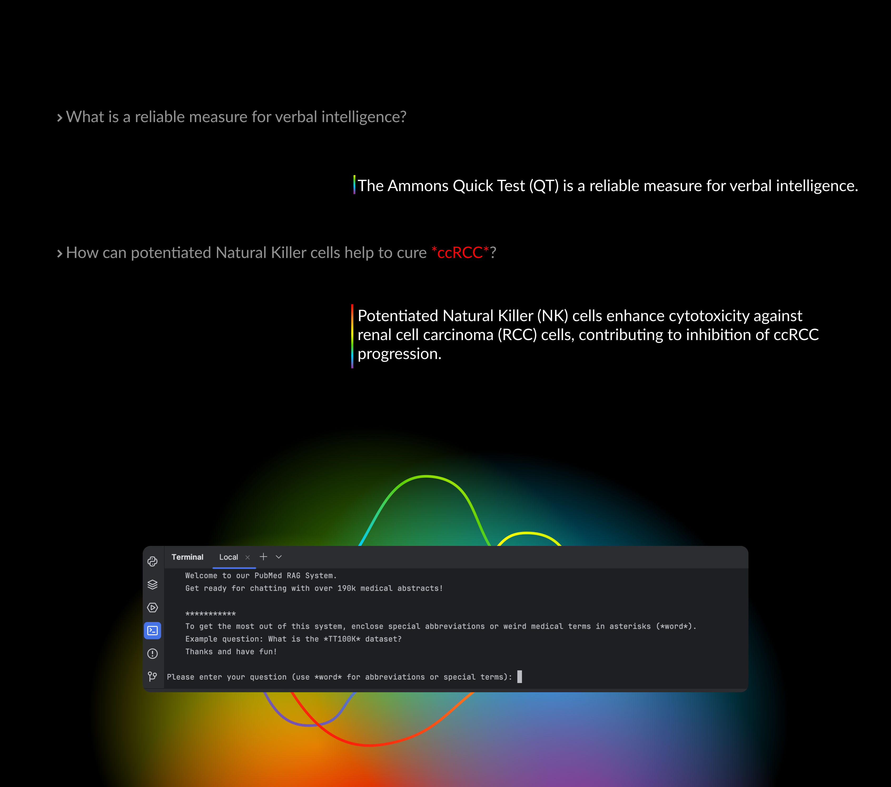

# pubMedNLP
Transformer-based Question Answering System trained on PubMed data.


## Contributors: 
- Kenneth Styppa (GitHub alias 'KennyLoRI' and 'Kenneth Styppa')
- Daniel Bogacz (GitHub alias 'bgzdaniel')
- Arjan Siddhpura (GitHub alias 'arjansiddhpura')

## Overview

This project utilizes a combination of Kedro, Langchain, ChromaDB, and llama2.cpp to build a retrieval augmented generation system for medical question answering. The project is structured into modular pipelines that can be run end-2-end to first obtain the data, preprocess and embed the data, and later perform queries to interact with the retrieved information similar to a Q&A chatbot. Due to the modularity, it is only a matter of a different command line prompts to use the latter, i.e. the readily developed Q&A system. 

## Technologies Used

- **Kedro:** Kedro is a development workflow framework that facilitates the creation, visualization, and deployment of modular data pipelines.

- **Langchain:** Langchain is a framework for developing applications powered by language models, including information retrievers, text generation pipelines and other wrappers to facilitate a seamless integration of LLM-related open-source software.

- **ChromaDB:** Chroma DB is an open-source vector storage system designed for efficiently storing and retrieving vector embeddings.

- **llama2.cpp:** llama2.cpp implements Meta's LLaMa2 architecture in efficient C/C++ to enable a fast local runtime.

## Installation & set-up

1. **Prerequisites:**
   - Ensure you have Python installed on your system. Your Python version should match 3.11.6
   - Ensure to have conda installed on your system.
   - Create a folder where you want to store the project. Call it e.g. pupMedNLP

   ```bash
   python --version
   conda --version
   # ls, cd etc. to get to your working directory
   ```

2. **Create a Conda Environment:**
   - Create a conda environment
   - Activate the environment
   ```bash
   conda create --name your_project_env python=3.11.6
   conda activate your_project_env
   ```

4. **Clone the Repository into your working directory:**
   ```bash
   git clone https://github.com/KennyLoRI/pubMedNLP.git
   cd your-project
   ```

5. **Install Dependencies:**
   ```bash
   pip install -r requirements.txt
   ```
6. **Download data and model files and place them into the right location:**
   - Go to [this](https://drive.google.com/drive/folders/1-6FxGDDKGD-sMwT2Pax7VVMLzuZUH0DG) Google drive link and download the chromaDB store (folder called `chroma_store_abstracts`) as well as the llama2.cpp [model files](https://huggingface.co/TheBloke/Llama-2-7b-Chat-GGUF/blob/main/llama-2-7b-chat.Q5_K_M.gguf).
   - Insert the chromaDB store at `[your_folder]/kedronlp/`
   - Insert the model file into `kedronlp/data/06_models/` and keep the name.

## Usage
### Using the Q&A system
1. **Navigate to the kedronlp folder in your terminal:**
   ```bash
   cd [your_folder]/kedronlp
   ```

2. **Activate the Q&A System:**
   ```bash
   kedro run --pipeline=chat
   ```
3. **Interact with the system:**
   - Ask your question
   ```bash
   Please enter your question (use *word* for abbreviations or special terms): [your_question]
   ```
   - Ask another question (and so on)
  
### Trouble-shooting: 
- If you encounter an issue during your usage install pyspellchecker separately and try again:
  ```bash
  pip install pyspellchecker
  ```

### Optional usage possibilities 
1. **Visualize the pipeline:**
   - Use built-in features from Kedro to get an overview of the pipeline in your browser
   ```bash
   kedro viz
   ```
2. **Test the preprocessing pipeline:**
   - Note: This is not advised since it may take a long time to extract the abstracts from PubMed and embed them (+ the PubMed API is not altogether stable):
  ```bash
  kedro run --pipeline=data_processing
  ```
3. **Create paragraphs out of abstracts:**
   - Go to `kedronlp/scripts/`. For this, the file `extract_data.csv` is required. It needs to be placed in `data/01_raw/`. See [here](https://drive.google.com/drive/folders/1-6FxGDDKGD-sMwT2Pax7VVMLzuZUH0DG) for the data.
   ```bash
   python create_paragraphs.py
   ```
4. **Embedding of abstracts or paragraphs:**
   - For embedding abstracts the file `extract_data.csv` is required. See [here](https://drive.google.com/drive/folders/1-6FxGDDKGD-sMwT2Pax7VVMLzuZUH0DG) for the data. Go to `kedronlp/scripts/`.
   ```bash
   python abstract2vec.py
   ```
   - For embedding paragraphs the file `paragraphs.csv` is required. See [here](https://drive.google.com/drive/folders/1-6FxGDDKGD-sMwT2Pax7VVMLzuZUH0DG) for the data. Go to `kedronlp/scripts/`.
   ```bash
   python paragraph2vec.py
   ```
5. **Loading embeddings to the vector database ChromaDB**
   TODO: @Daniel

## Project Structure

- **data/**: This directory contains the raw and processed data as well as the model files used by the project.
- **src/**: The source code of the project is organized into modules within this directory.
- **conf/**: Configuration files for Kedro and other tools are stored here. If you want to run the pipelines with different retrievers, or hyperparameters you can change them in the parameters.yml file and they will automatically be broadcasted to all necessary files.
- **scripts/**: Contains basic scripts we used during developing the project. They are not relevant to the pipeline.
- **notebooks/**: Contains tests and analysis notebooks. Have a look here to see our own evaluation of our system
- **docs/**: Documentation related to the project.

## Acknowledgments
We thank Prof. Gertz for this engaging course and Satya for her time to give us helpful advice. 
